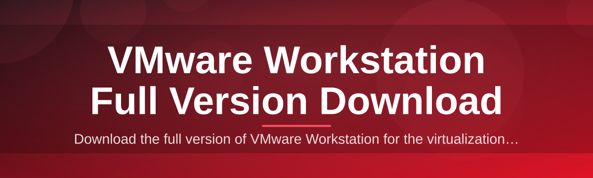

# vmware-workstation-suite-manager 🖥️✨

  

*The friendly companion that turns a messy VMware Workstation setup into a calm, organized workspace.*

## 🌱 Overview

Every virtualization journey starts the same way: someone needs to spin up a lab, test an OS, or isolate a risky app, and they land on the search term "VMware Workstation Full Version Download" hoping for something that just works. This project was born out of that exact moment — a small internal tool a few of us hacked together (in the good, harmless sense of tinkering) to stop re-doing the same manual setup steps every time we provisioned a new machine for virtualization work. Over time it grew into a full suite manager that thousands of people now rely on to keep their VMware Workstation environment tidy, discoverable, and easy to launch.

At its core, `vmware-workstation-suite-manager` is a lightweight Windows companion app that sits beside your existing VMware Workstation installation and gives you a friendly control center: a single place to check your version, review system compatibility, organize virtual machine shortcuts, and jump straight to the official landing page whenever you need the latest build. It doesn't reinvent virtualization — it makes the *experience around it* pleasant. Think of it as the tidy front desk of a busy hotel, while VMware Workstation itself is the hotel.

This tool is for the homelab tinkerer running three VMs at once, the QA engineer who needs a clean snapshot environment every morning, the student learning networking on isolated virtual switches, and the sysadmin who just wants a dashboard instead of a dozen scattered `.exe` shortcuts. If any of that sounds like you, you're exactly who we built this for.

  

> [!TIP]
> New here? Skim the **How It Works** section below before you download — it'll save you five minutes of guessing later.

---

## 🔥 What This Suite Actually Does

- **Unified Dashboard** — instead of hunting for `.vmx` files across drives, you get one visual panel listing every virtual machine you've ever set up, sorted however you like.

- **Version Awareness** — the manager checks what you currently have installed and gently flags when a newer VMware Workstation Full Version Download is available on the official landing page, so you're never running something stale without knowing it.

- **Compatibility Radar** — before you commit to downloading anything, it scans your Windows build, RAM, and virtualization flags (VT-x/AMD-V) so you know upfront whether your rig is ready.

- **One-Click Launch Shortcuts** — pin your most-used VMs to a quick-launch strip, so booting your test lab feels like opening a browser tab, not archaeology.

- **Snapshot Timeline View** — see your snapshot history as a horizontal timeline instead of a nested tree, which makes rollback decisions dramatically less stressful.

- **Resource Usage Glance** — a live-ish meter shows how much host RAM and CPU your running VMs are currently borrowing, so you can spot a runaway guest before it slows your whole machine.

- **Theming & Personalization** — light, dark, and a genuinely nice "midnight teal" theme, because staring at gray dialog boxes all day is nobody's idea of fun.

- **Portable Config Export** — export your VM list and preferences as a small file you can carry to another machine, handy when you're rebuilding a workstation from scratch.

> [!NOTE]
> This suite manager is a companion utility — it organizes and points you toward VMware Workstation, it does not replace or modify the hypervisor itself.

---

## 🚀 How to Get Started

Getting going takes about the length of a coffee break. Here's the whole path:

1. **Visit the landing page** using the download button on this page — that's the only place we publish builds.

2. **Grab the latest release** for Windows; the page always reflects the current 2026 build.

3. **Run the installer** and let it place itself alongside your existing VMware Workstation setup — no extra dependencies needed.

4. **Open the dashboard**, let it scan your system once, and you're ready to organize, launch, and monitor your VMs.

  

---

## 🧩 System Requirements

  

| Requirement | Minimum | Recommended |
|---|---|---|
| OS | Windows 10 (64-bit) | Windows 11 (64-bit) |
| RAM | 4 GB | 8 GB+ |
| Disk Space | 150 MB free | 500 MB free |
| CPU Virtualization | VT-x / AMD-V enabled | Same, plus nested virtualization support |
| Dependencies | None — fully standalone | None |
| .NET / Runtime | Bundled internally | Bundled internally |

> [!IMPORTANT]
> The suite manager runs standalone with zero external dependencies — no separate runtime installs, no background services fighting for attention.

---

## ⚙️ How It Works

Under the hood, the flow is intentionally simple — three moving parts, no drama:

1. **Detection** — on launch, the app quietly reads your local VMware Workstation installation path and version metadata.

2. **Comparison** — it checks that against the current build published on the official landing page.

3. **Presentation** — results appear in the dashboard: green if you're current, amber if an update is worth grabbing.

4. **Action** — if you choose to update, you're routed straight to the landing page's Full Version Download button — never a random mirror.

5. **Organization** — meanwhile, your VM list, snapshots, and shortcuts stay indexed and ready in the background.

---

## 🛟 Troubleshooting

<strong>The dashboard says virtualization is disabled — what now?</strong>

Head into your motherboard's BIOS/UEFI settings and enable VT-x (Intel) or AMD-V (AMD). Windows' own "Turn Windows Features On or Off" panel can also block this if Hyper-V is competing for the same CPU extensions.

<strong>It can't detect my existing VMware Workstation install.</strong>

This usually happens when Workstation was installed to a non-default drive letter. Open Settings inside the suite manager and manually point it to your installation folder once — it remembers after that.

<strong>My VM shortcuts disappeared after a Windows update.</strong>

Windows updates occasionally reset file associations. Re-run the scan from the dashboard's refresh icon and your shortcuts will re-populate automatically.

<strong>The resource meter shows 0% even though a VM is running.</strong>

Give it a few seconds — the meter polls on an interval rather than continuously, to keep the app itself lightweight and low-impact.

<strong>Is this safe to run alongside my current VMware Workstation license?</strong>

Yes. The manager never touches licensing files — it only reads version and path metadata and links you to the official download page for anything version-related.

> [!WARNING]
> Always download VMware Workstation itself only from the official landing page linked here. Third-party mirrors are the most common source of corrupted or tampered installers.

---

## 🎨 UI / UX Details

The interface leans minimal on purpose — fewer clicks, more clarity. Here's the shortcut cheat sheet power users end up memorizing within a day:

| Shortcut | Action |
|---|---|
| `Ctrl + N` | Add a new VM shortcut |
| `Ctrl + L` | Launch selected virtual machine |
| `Ctrl + R` | Refresh / rescan installation |
| `Ctrl + D` | Toggle dark / light / midnight teal theme |
| `Ctrl + S` | Open Snapshot Timeline view |
| `Ctrl + ,` | Open Settings panel |
| `Ctrl + F` | Search across all VMs |
| `Delete` | Remove selected shortcut (does not delete VM files) |
| `F5` | Force a full resource meter refresh |
| `Esc` | Close active dialog |

> [!TIP]
> Hold `Shift` while dragging a VM entry to reorder your quick-launch strip without opening the settings menu.

Themes persist per Windows user profile, and every setting — theme, shortcut order, snapshot view preference — lives in a small portable config file so your setup travels with you.

---

## 🤝 Contributing & Community

This project grew because people kept showing up with good ideas, sharper UI suggestions, and patient bug reports. If you'd like to join in:

- Open an issue describing what you'd like to see — screenshots help enormously.
- Fork the repository and submit a pull request against the `main` branch.
- Keep PRs focused — one improvement per request makes review faster for everyone.
- Be kind in discussions; most contributors here are volunteering their evenings.

> [!NOTE]
> No prior virtualization expertise required to contribute — plenty of our best UI fixes came from first-time contributors.

---

## 📄 License

Released under the [MIT License](LICENSE), © 2026. Use it, fork it, build on it — just keep the license notice intact.

---

## ⚠️ Disclaimer

`vmware-workstation-suite-manager` is an independent, community-built companion tool and is not affiliated with, endorsed by, or sponsored by Broadcom or VMware. All trademarks belong to their respective owners. This project only organizes and points users toward the official VMware Workstation Full Version Download landing page — it does not host, modify, or redistribute VMware's software.

  

